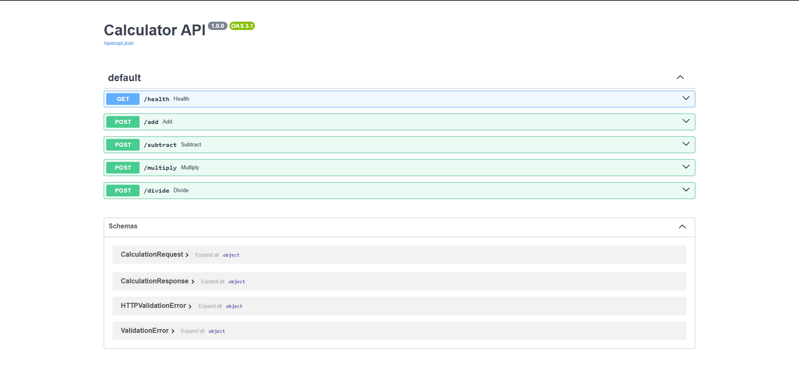
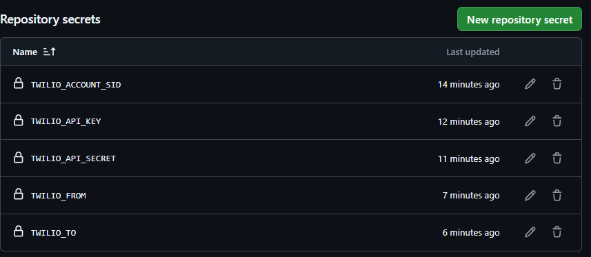
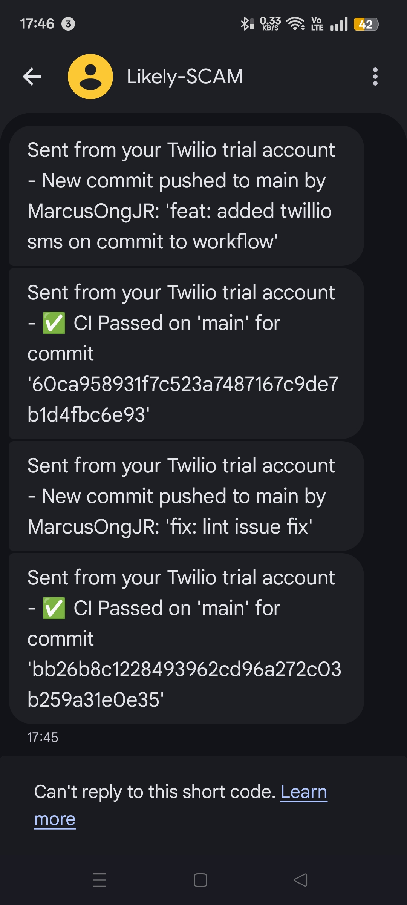

# DevOps CA Next Steps Advanced Topics:
- Container-based workflows
- Slack/Discord notifications (SMS Notifications)

Python script for a Calculator API using docker and container based workflow implementation
Twillio workflow integration to notify user when a push is made to main
Twillio API infor in secrets

## API Docs

## Secrets on Github

## Twillio Msgs results
